<div align="center">

# ✨ AI Governance Labs

[](LICENSE)
[](policies/)
[](notebooks/)
[](https://learn.microsoft.com/azure/api-management/)

### Govern Microsoft Foundry Models behind Azure API Management &mdash; with policy, not application code



</div>

---

A hands-on lab series demonstrating how to govern AI workloads (Microsoft
Foundry Models behind Azure API Management) using policy-driven controls:
token limits and quotas, chargeback metering, bidirectional content safety,
and resilient backend pools.

Each lab is delivered as a Python Jupyter notebook that creates everything it
needs on an existing APIM instance, applies governance policies, and then
demonstrates the resulting behavior live.

## Prerequisites

- An Azure subscription with an **existing Azure API Management (APIM)
  instance**. The notebooks do not create the APIM instance itself, only the
  APIs/policies/subscriptions on top of it.
- **Azure CLI**, logged in via `az login` before you start. The notebooks
  use `AzureCliCredential` (falling back to `DefaultAzureCredential`) and
  never open an interactive browser login.
- **Python 3.10+**
- A **Microsoft Foundry / Azure OpenAI** resource with a chat-completion
  model deployed (e.g. `gpt-4o-mini`), and either:
  - the APIM system-assigned managed identity granted the
    `Cognitive Services OpenAI User` role on the resource (preferred), or
  - an API key (used as a fallback).
- **For Demo 3 only:** an **Azure AI Content Safety** resource (kind
  "Content Safety"), and either:
  - the APIM system-assigned managed identity granted the
    `Cognitive Services User` role on the Content Safety resource
    (preferred), or
  - a Content Safety API key (used as a fallback).
- **For Demo 4:** an APIM SKU supporting backend pools and circuit breakers:
  **Basic v2, Standard v2, Premium v2, or classic Standard/Premium**. Extra
  model endpoints are optional; without them the notebook uses one
  origin as three logical members. All pool members must use the **same model
  and version** to avoid silent model drift.

### APIM SKU requirements

Demo 1 relies on the provider-agnostic **`llm-token-limit`** policy. It is
supported on **Developer**, **Basic**, **Basic v2**, **Standard**,
**Standard v2**, **Premium**, and **Premium v2** tiers, but not on
**Consumption**. Confirm your APIM SKU supports `llm-token-limit` before
running Demo 1 -- `00-setup-and-validation.ipynb` will print your instance's
SKU as part of its checks.

`llm-token-limit` is preferred over the provider-specific predecessor,
`azure-openai-token-limit`, because it supports Foundry models,
OpenAI-compatible APIs, Anthropic, and Vertex AI. It provides both TPM rate
limiting and long-term quotas through `token-quota` and
`token-quota-period`, returning 429 for TPM bursts and 403 for quota
exhaustion. It is also the focus of Microsoft's AI Gateway investment.

Demo 3's **`llm-content-safety`** policy is supported on the same set of
tiers (Developer, Basic, Basic v2, Standard, Standard v2, Premium, Premium
v2), not on Consumption.

Demo 4's backend pool and circuit-breaker support is limited to **Basic v2,
Standard v2, Premium v2, classic Standard, and classic Premium**. It is not
available on Consumption, Developer, or classic Basic.

## Getting started

```bash
python -m venv .venv
source .venv/bin/activate   # or .venv\Scripts\activate on Windows
pip install -r requirements.txt
az login
jupyter notebook
```

> **Upgrading an existing `.venv`?** Token metrics are read from the
> Application Insights `customMetrics` table with `azure-monitor-query`'s
> `LogsQueryClient`: `llm-emit-token-metric` emits through the APIM
> Application Insights logger, and custom metric namespaces are not served at
> APIM resource scope. Re-run `pip install -r requirements.txt` and restart
> your Jupyter kernel so the dependency set is picked up.

1. Open and run **`notebooks/00-setup-and-validation.ipynb`** first. It
   confirms your `az login` session, lets you pick/confirm a subscription,
   prompts for your resource group and APIM instance name, validates
   connectivity, and persists everything to a local `.env` file (never
   committed) so subsequent notebooks run non-interactively.
2. Open a demo notebook from the table below.

Configuration precedence in every notebook is: **environment variables**
&rarr; **`.env` file** &rarr; **interactive prompt** (with the answer
persisted back to `.env`). Secrets (API keys, subscription keys, tokens) are
always masked in notebook output and are never printed in full.

## The demos

| # | Notebook | Topic | Status |
| - | -------- | ----- | ------ |
| 1 | [`demo1-token-limits.ipynb`](notebooks/demo1-token-limits.ipynb) | Token limits & quota enforcement (TPM burst -> 429, daily budget -> 403) | **Complete** |
| 2 | [`demo2-token-metrics.ipynb`](notebooks/demo2-token-metrics.ipynb) | Token metering & chargeback dimensions | **Complete** |
| 3 | [`demo3-content-safety.ipynb`](notebooks/demo3-content-safety.ipynb) | Content safety - inspect both directions | **Complete** |
| 4 | [`demo4-resilient-pool.ipynb`](notebooks/demo4-resilient-pool.ipynb) | Resilient backend pools -- priority/weight routing, circuit breakers, spillover | **Complete** |

Every demo notebook follows the same template, so new demos can be dropped
in without changing the `shared/` helpers:

`Scenario` -> `Isolation` -> `Configure (policy apply)` -> `Baseline` ->
`Demonstrate` -> `Observe` -> `Reset / Cleanup` -> `Talk track`

## Repository structure

```
README.md                      # this file
requirements.txt               # Python dependencies
.env.example                   # config template (copy to .env, or let notebooks prompt you)
.gitignore
docs/
  ai-governance-flows.svg      # animated end-to-end flow diagram for all four demos
shared/
  config.py                    # load/prompt config, persist to .env, validate
  apim.py                      # idempotent APIM control-plane helpers (ARM REST)
  auth.py                      # AzureCliCredential / DefaultAzureCredential helpers + ARM token
  display.py                   # tables, headers, banners, charts
  fixtures.py                  # versioned Demo 3 content-safety test-matrix fixtures
policies/
  demo1-token-limit.xml        # API-scope policy for Demo 1
  demo2-emit-token-metric.xml  # API-scope policy for Demo 2
  demo3-content-safety.xml     # API-scope policy for Demo 3 (inbound + outbound)
  demo4-resilient-pool.xml     # API-scope policy for Demo 4 pool routing
  demo4-mock-origin.xml        # APIM-hosted observable mock origin for Demo 4
notebooks/
  00-setup-and-validation.ipynb  # shared prerequisite check
  demo1-token-limits.ipynb       # Demo 1 (complete)
  demo2-token-metrics.ipynb      # Demo 2 (complete)
  demo3-content-safety.ipynb     # Demo 3 (complete)
  demo4-resilient-pool.ipynb     # Demo 4 (complete)
```

## Named value convention

APIM resolves `{{token}}` references in policy XML against a named value's
**display name**, and the match is case-sensitive. To avoid mismatches, this
repo requires the named value **id and display name to be identical,
lowercase, and equal to the `{{token}}` used in the policy XML** (for example
`demo1-tokens-per-minute`). `shared/apim.ensure_named_value` raises a
`ValueError` if the id and display name differ.

Named values interpolated into `condition` / `set-body` expressions must also
be created with `secret=False`; secret named values cannot be interpolated
there.

## Demo 1: Token limits & quota enforcement

Demo 1 shows a complete, idempotent, end-to-end flow:

1. Creates a dedicated APIM subscription and product for isolation, plus the
   model-backed API, backend, named values, and operation -- all
   before any calls are made.
2. Applies a policy at **API scope** using `llm-token-limit` for both the
   tokens-per-minute limit and the native daily `token-quota`.
3. Makes a baseline call and reads the `tokens-consumed`, `remaining-tokens`,
   and `remaining-quota-tokens` headers.
4. Bursts requests until a `429` with `Retry-After` is observed.
5. Continues (respecting `Retry-After`) until the daily token budget is
   exhausted and a `403` is returned.
6. Summarizes what happened, then demonstrates an **instant reset** by
   changing the `x-demo-run` suffix baked into the policy's counter key.
7. Leaves its APIM resources in place -- Demos 2-4 reuse the same APIM
   instance, so cleanup is covered at the end of the final demo.

Re-running `demo1-token-limits.ipynb` end to end, twice in a row, does not
fail or duplicate any Azure resources.

## Demo 2: Token metering & chargeback dimensions

Demo 2 builds on the **same APIM instance** and Microsoft Foundry / Azure
OpenAI backend values used in Demo 1. It creates only Demo 2-scoped APIM
resources on that existing instance:

1. A dedicated product (`demo2-metering`) and subscription
   (`demo2-metering-sub`) for chargeback isolation.
2. A dedicated API (`demo2-metering-api`), backend
   (`demo2-openai-backend`), operation, and optional AOAI key named value.
3. API-scope diagnostics wired to an Application Insights logger when the
   required Application Insights values are available.
4. An API-scope inbound policy using `llm-emit-token-metric` to publish prompt,
   completion, and total token metrics into the `module8` namespace, split by
   `API ID`, `Subscription ID`, and bounded `ClientApp`.

Before sending traffic, the notebook displays the required preflight checks
out loud:

- **Application Insights connected**: APIM has an Application Insights logger
  or the notebook has enough `APP_INSIGHTS_*` values to create one.
- **LLM API logging enabled**: the Demo 2 API diagnostic has LLM /
  large-language-model logging settings.
- **Support custom metrics enabled**: the Demo 2 API diagnostic has
  `metrics: true`. Without it the token metrics emitted by the policy are
  silently discarded. The Configure section always sets it, so re-run that
  section if the verify step reports it as disabled.
- **Custom metrics with dimensions enabled**: App Insights **Enable alerting
  on custom metric dimensions** / usage-and-estimated-costs setting. If ARM
  cannot detect the setting, the notebook shows a clear manual portal
  instruction.
- **Client sends a bounded `x-client-app` value**: the client helper enforces
  an allow-list (`claims-portal`, `analyst-copilot`) before sending requests.

To prove the meter, Demo 2 sends **five calls as `claims-portal`** and
**three calls as `analyst-copilot`**, then queries token metrics in 5-minute
bins split by `ClientApp`. The notebook includes retry/backoff because Azure
Monitor and Application Insights custom metrics can have ingestion delay.

Acceptance criteria displayed in the notebook:

- **PASS 01:** Two `ClientApp` series appear.
- **PASS 02:** Prompt + completion reconcile to total.
- **PASS 03:** Subscription filters cleanly isolate chargeback.

Demo 2 also includes the streaming caveat: request token usage from the
provider when supported
(`stream_options: {"include_usage": true}`), and remember that interrupted
streams can produce incomplete counts.

## Demo 3: Content safety - inspect both directions

Demo 3 builds on the **same APIM instance** and Microsoft Foundry / Azure
OpenAI backend values used in Demos 1 and 2. It additionally requires a new
**Azure AI Content Safety** resource (kind "Content Safety") and, if you are
not supplying a key, an APIM managed-identity role assignment on it (see
Prerequisites above).

Demo 3 creates only Demo 3-scoped APIM resources on the existing instance:

1. A dedicated product (`demo3-content-safety`) and subscription
   (`demo3-content-safety-sub`) for isolation.
2. A dedicated API (`demo3-content-safety-api` at path
   `/demo3-content-safety`), the model backend
   (`demo3-openai-backend`), a new Content Safety backend
   (`demo3-content-safety-backend`), and the `chat-completions` operation.
3. Named values for the four category thresholds (`Hate`, `SelfHarm`,
   `Sexual`, `Violence`, default `4`), an optional blocklist id, and optional
   `demo3-aoai-key` / `demo3-content-safety-key` keys.
4. An API-scope policy (`policies/demo3-content-safety.xml`) applying the
   `llm-content-safety` policy **twice**: once **inbound** and once
   **outbound**.

**Content safety is one policy in two directions:**

- **Inbound - prompt checks:** `shield-prompt="true"` detects prompt
  injection / jailbreak attempts, and the four category checks
  (`<categories output-type="EightSeverityLevels">`) block prompts whose
  harm score meets or exceeds the configured threshold.
  `enforce-on-completions="true"` additionally validates the eventual
  (non-streaming) completion from the same inbound instance.
- **Outbound - completion checks:** a second `llm-content-safety` instance in
  `<outbound>` re-checks the actual completion with `window-size` /
  `window-overlap-size`, which are only configurable for responses. **Stress
  this half out loud: models can produce unsafe content even from perfectly
  benign prompts**, so an inbound-only check is not sufficient.

Severity thresholds run **0-7** on the `EightSeverityLevels` scale across
`Hate`, `SelfHarm`, `Sexual`, and `Violence`. **Choosing a threshold is a
business decision, not an engineering default** -- involve your Responsible
AI reviewers before changing the defaults (`CONTENT_SAFETY_THRESHOLD_*` in
`.env`, default `4` for all four).

The notebook drives the test matrix and renders it with
`display.show_table` (Case / Input / Expected / Actual+Evidence):

| Case | Input | Expected | Evidence |
| --- | --- | --- | --- |
| Safe business prompt | Approved benign fixture | `200` | Request + completion pass |
| Prompt attack | Approved injection fixture | `403` | Prompt shield blocks |
| Harm threshold | Approved severity >= 4 fixture | `403` | Category policy blocks |
| Streaming completion | Controlled stub fixture | `STREAM STOPS` | No later events forwarded |

> The shipped harm-category and streaming fixtures are deliberately mild and
> may not trip a default threshold. If a row reports **NOT TRIPPED**, substitute
> your organization's pre-approved evaluation-set fixture or lower the relevant
> `CONTENT_SAFETY_THRESHOLD_*` value toward the low end of the 0-7 scale for the
> demonstration. Production thresholds remain a Responsible AI business
> decision, not an engineering default.

On a `403`, the policy's `<on-error>` handling (keyed on
`context.LastError.Source == "llm-content-safety"`) returns a clear JSON body
plus `x-content-safety-decision` / `x-content-safety-reason` response
headers as evidence. For the **streaming** case, Microsoft's documented
behavior is that a detected violation makes APIM **stop forwarding further
events to the client without returning a 403** -- the notebook demonstrates
this by showing the stream end early, with no trailing `[DONE]` event.

> **Demo safety rule:** use versioned, pre-approved fixtures from your own
> evaluation set (`shared/fixtures.py`, version-stamped via
> `FIXTURE_SET_VERSION`). **Never improvise "harmful" examples live** -- it is
> a compliance risk and it makes results unrepeatable. The fixtures shipped
> here are deliberately mild, non-graphic, clearly-labelled placeholders that
> exercise the mechanism only; substitute your own organization's
> pre-approved evaluation-set fixtures before delivering this to an audience.

Demo 3 leaves its APIM resources in place -- Demo 4 reuses the same APIM
instance, so cleanup is covered at the end of the final demo. Re-running
`demo3-content-safety.ipynb` end to end, twice in a row, does not fail or
duplicate any Azure resources.

## Demo 4: Resilient backend pools

Demo 4 reuses the same APIM instance and Microsoft Foundry / Azure OpenAI
configuration from Demos 1-3. It creates only Demo 4-scoped resources:

1. An APIM-hosted mock-origin API (`demo4-mock-origin-api`) with East,
   Central, and PAYG operations. It returns a chat-completions-shaped response
   with an `x-served-by` member id, and named-value fault switches can make
   one member return `429` with `Retry-After`. It uses the existing APIM
   instance only, so no PTU capacity or extra Azure resource is required.
2. Three backends: `demo4-ptu-east`, `demo4-ptu-central`, and `demo4-payg`.
   Each has a circuit breaker that trips on 429 and 5xx responses and honors
   an origin `Retry-After`.
3. A `demo4-aoai-pool` Pool backend with East and Central at priority 1
   (weights 2 and 1), then PAYG at priority 2 for spillover. APIM requires
   each `pool.services[].id` to be the backend's ARM resource id
   (`/subscriptions/.../service/{apim}/backends/{name}`), not its short name;
   `apim.ensure_backend_pool` accepts short names and expands them.
4. A dedicated API (`demo4-resilient-pool-api`), product, subscription, and
   optional `demo4-aoai-key` named value.
5. An API-scope policy whose single
   `<set-backend-service backend-id="demo4-aoai-pool" />` line delegates
   selection to APIM.

The notebook has two explicit modes: **routing mode** points the pool at the
mock members, while **inference mode** makes a baseline call through the same
pool policy to the real model endpoint. The mock proves the routing; the real
backend proves the inference.

Routing mode mirrors the four demonstration phases: **CALL 1**, **CALL 2**,
**FAULT**, and **RECOVER**. It displays the observed `x-served-by` value for
every call, keeps a 30-call East:Central distribution with an expected
approximately 2:1 ratio, faults East first so Central receives priority-1
traffic, then faults both primaries to show PAYG spillover. Fault controls are
healed in `finally`, and a separate heal-everything cell is available at any
time.

The client request code is printed once and remains byte-identical in every
phase: the same URL, headers, and body are reused. **No client change at all;
the backend ID changes in traces -- resilience without touching application
code.**

Routing is a **per-call** priority -> weight -> health decision; a circuit-open
member is removed from selection. Keep identical model and version deployments
across every member, or otherwise successful calls can silently drift. The
final section offers a clearly gated, optional cleanup of Demo 1-4 APIs,
products, subscriptions, backends, named values, loggers, and diagnostics
while leaving the APIM instance intact.
